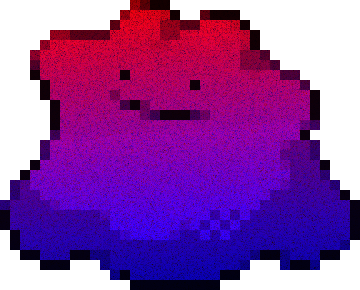

 

  
   
   
   

> [!IMPORTANT]
> This project was never intented to be maintained.
> 
> Please stop asking me to update this project.
> Take a look at Midnight if you want something better.

> [!CAUTION]
> It has been brought to my intention that someone is impersonating me on telegram and discord, actively trying to charge kids $10 for this free and open-source project. There is no 'private' version of this software.
> 
> I have already reported the accounts, if you interacted with them please send me a message.
> If you are unsure wether it's me or not, here are my **only** socials:
> 
> Telegram: @Liverus
> 
> Discord: Liverus
>
> This kind of behaviour is what makes me want to stop releasing stuff, even if it's crap.
> Please report this person if you encounter him:
> 
> 

# About

Metamorph is a Windows HWID-Spoofer project for the game SCP:SL. It internally uses kd-mapper to load an unsigned driver for the kernel part.
The spoofer has been made specifically for changing what SCP:SL collects and not anything else. Therefore, Metamorph will hardly have any value outside of its original purpose.

The code is garbage and pasted but it serves its purpose. I take no credit for the creation of this abomination except for the spaghetti code, it's all me.

Tested on the 12/02/2024 for Windows 11 (10.0.22631).

# Features

## Windows
* ComputerName
* Digital Product ID
* Product ID
* Install Date
* Machine GUID
* Wallpaper (To default dark)

## Misc
* ARP Table
* Network Adapters MAC
* SMBIOS
* Motherboard MAC
* Disks

# Limitations

The code relies on Mutante by SamuelTulach which is as he stated, "heavily outdated". Therefore, consider this project as the same.
There are still a few remaining detection vectors:
* IP Address
* User Security ID (SID)
* Network Adapters (Some may fail to change)

# Credits

* [Mutante](https://github.com/SamuelTulach/mutante) by SamuelTulac
* [HWID](https://github.com/btbd/hwid) by BTBD
* [KDMapper](https://github.com/TheCruZ/kdmapper) by TheCruZ
